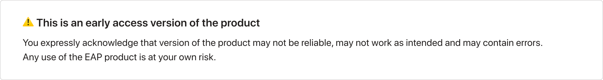

# Qodana Docker Image




Supported tags: 2020.3-eap, latest (points to 2020.3-eap)

## General

This image allows you to perform [static analysis](https://en.wikipedia.org/wiki/Static_program_analysis) of your 
code base. In the course of time Qodana will support all languages and technologies covered by IntelliJ IDEs. We will 
add them on a one-by-one basis and describe what one can expect on [each area](../Technologies/README.md). 

The image gives you the following options optimized for different scenarios:
- Running the analysis on a regular basis as a part of your continuous integration (*CI-based execution*)
- Single shot analysis (performed *locally*, for example) 

If you prefer the first option and have established continuous integration (CI) support for your project, this page 
  will guide your through all possibilities. If you don't have any CI for your project we encourage you to try 
  JetBrains TeamCity either on-premise or in cloud. In this case you can switch to our [TeamCity plugin](https://github.com/JetBrains/Qodana/tree/main/TeamCity%20Plugin) as it gives more options. 


If you are familiar with [IntelliJ IDEs code inspections](https://www.jetbrains.com/help/idea/code-inspection.html)
and know what to expect from the static analysis outside the editor, you can start with the [using existing profile](README.md#using-existing-profile) section. 


If you are just starting in the field, we recommend beginning with the [default setup](README.md#quick-start-with-recommended-profile) we provide. You will see the 
results of most common checks performed on your code base. Then you will be able to [adjust them](README.md#how-configure) to cover your needs better.


### Quick start with a recommended profile

*To run analysis locally*
1) Pull the image from Docker Hub Registry 
   ```
   docker pull jetbrains/qodana:2020.3-eap
   ```
2) Run the following command
   ```
   docker run -v <project-folder>/:/data/project/ \
              -v <output-folder>/:/data/results/ \
              -p 8080:8080 \
   jetbrains/qodana:2020.3-eap --show-report
   ```
   Please note, that `project-folder` and `output-folder` are the full local paths on your machines to the project 
   source code folder, and the analysis results folder accordingly.
   
   This command will run the analysis of your source code and spin the web server to give you a convenient way to 
   the see the results. Open `http://locahost:8080` in your browser to examine the found problems and checks 
   performed. Also, it brings a simple way to re-configure the analysis. The [UI section](../UI/README.md) of 
   this guide covers all the topics.

   In case when you don't need the user interface and prefer to study raw data, please use the following command 
   ```
   docker run -v <project-folder>/:/data/project/ \
              -v <output-folder>/:/data/results/ \             
   jetbrains/qodana:2020.3-eap 
   ```
   
   The `output-folder` will contain the [all necessary data](../General/output.md#basic-output). 
   You can tune the command further following the [technical guide](techs.md).
   
   If you run analysis several times in a row, ensure you've cleaned the result folder before using 
   it in `docker run` again. 
   

*To run analysis in CI*
1) Ensure the image will be pulled from the Docker Hub Registry
   ```
    docker pull jetbrains/qodana:2020.3-eap
   ```
2) Use the following command as the task
   ```
    docker run \ 
        -v <project-folder>/:/data/project/ \
        -v <output-folder>/:/data/results/ \
        jetbrains/qodana:2020.3-eap
   ```
  
   Please note, that `project-folder` and `output-folder` are the full paths to the project 
   source code folder, and the analysis results folder accordingly. 
   The `output-folder` will contain the [following output](../General/output.md#basic-output).
   

   
### Using existing profile

In this section, we assume that you are familiar with the concept of configuring the code analysis via [IntelliJ 
inspection profiles](https://www.jetbrains.com/help/idea/customizing-profiles.html). 

You can pass the reference the existing profile either via an additional parameter`-v <inspection-profile.
xml>:/data/profile.xml` to the `docker run` command or via a [qodana.yaml](#configure-via-qodanayaml) added to the root folder of your project.

Using additional parameter you command will be looked like
- For local execution with results in UI
 ```
    docker run -v <project-folder>/:/data/project/ \
              -v <output-folder>/:/data/results/ \
              -v <inspection-profile.xml>:/data/profile.xml
              -p 8080:8080 \
               jetbrains/qodana:2020.3-eap --show-report
   ```
- For CI-based execution
```
    docker run \ 
        -v <project-folder>/:/data/project/ \
        -v <output-folder>/:/data/results/ \
        -v <inspection-profile.xml>:/data/profile.xml
        jetbrains/qodana:2020.3-eap
   ```
### Configure via qodana.yaml

Please refer to [qodana.yaml](../General/qodana-yaml.md) documentation to learn about the format. The file will be 
automatically recognised and used for the analysis configuration, you don't need to pass any additional parameters. 
The references to the inspection profiles will be resolved in [a particular order](techs.md#order-of-resolving-profile).

### License
Qodana Docker image is under the JetBrains Terms of Services, JetBrains EAP policy, and JetBrains privacy policy.

