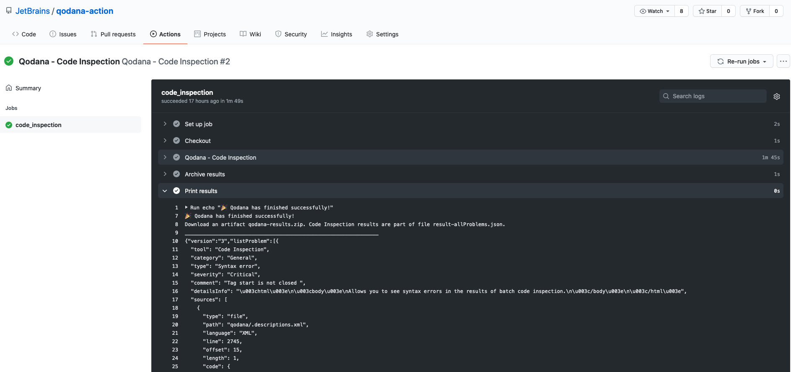

# Qodana GitHub Actions & Application

## General

## Quick start with 

## Github Action

GitHub Actions make it easy to automate all software workflows. A workflow is a configurable automated process made up of one or more jobs. You must create a YAML file to define your workflow configuration.

Anyone with write permission to a repository can set up continuous code inspection with Qodana using GitHub Actions. 

Templates for [Qodana Docker Image](Docker%20Image/README.md) are available in [this repository](https://github.com/JetBrains/qodana-action). 

