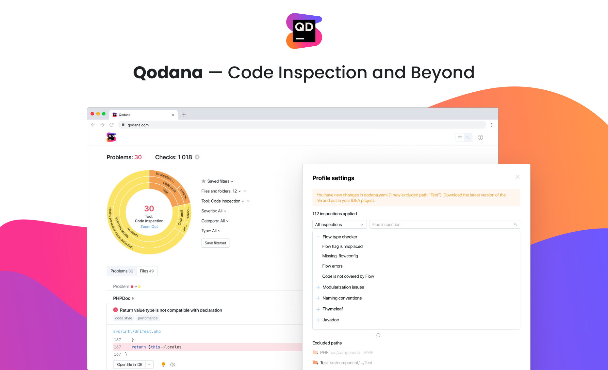

[](https://confluence.jetbrains.com/display/ALL/JetBrains+on+GitHub)



**Qodana** is a code quality monitoring tool that identifies and suggests fixes for bugs, security vulnerabilities, duplications, and imperfections.
It brings all the smart features you love in the JetBrains IDEs into your project pipelines.
It takes different shapes: [Docker for any CI](Docker/README.md), [GitHub actions & application](GitHub/README.md), a [TeamCity plugin](TeamCity/README.md), and a separate [cloud service](Service/README.md). They all share a common goal: guiding users towards more robust, more maintainable, and healthier code.

Qodana already supports PHP, Java, and Kotlin projects, and will eventually support all [languages and technologies](General/supported-technologies.md) covered by JetBrains IDEs.

### Analyse project locally

To start, pull the image from Docker Hub (only necessary to get the latest version):
```
docker pull jetbrains/qodana
```

and run the analysis locally:
```
docker run --rm -it -v <source-directory>/:/data/project/ -p 8080:8080 jetbrains/qodana --show-report
```

where `source-directory` should point to the root of your project.

Check the results in your browser at [`http://localhost:8080`](http://localhost:8080).

Please read our [Docker guide](/Docker/README.md) for more options and details related to the Qodana execution.

### Run at GitHub

You can set up a workflow in your GitHub repository using the [GitHub action](GitHub/README.md) we published.

### License

By using Qodana, you agree to the [JetBrains EAP user agreement](https://www.jetbrains.com/legal/agreements/user_eap.html) and [JetBrains privacy policy](https://www.jetbrains.com/company/privacy.html).

## Contact

Contact us at [qodana-support@jetbrains.com](mailto:qodana-support@jetbrains.com) or via [our issue tracker](https://youtrack.jetbrains.com/newIssue?project=QD). We are eager to receive your feedback on the existing Qodana functionality and learn what other features you miss in it.
