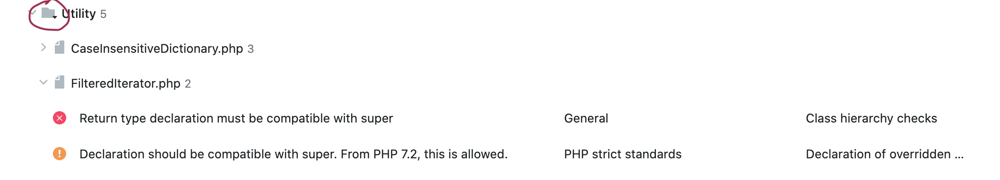
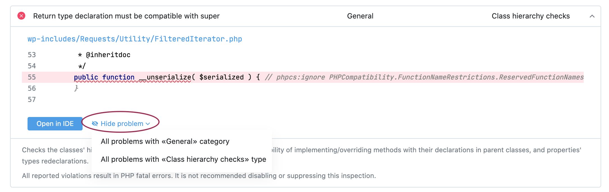
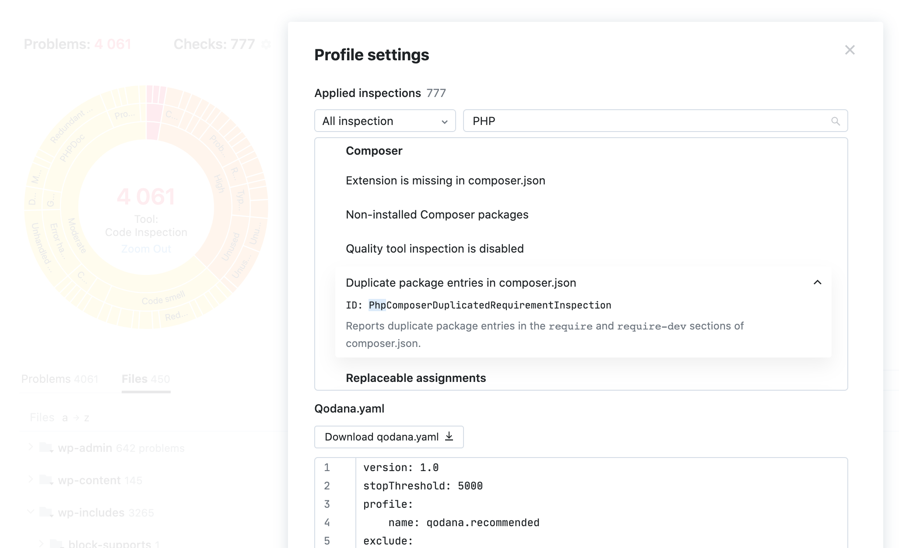

# Qodana. User Interface

The current version of Qodana UI is focused on the single-shot analysis. It allows browsing and acting 
on results as well as re-configuring the list of checks. 

### Problem Explorer

The interactive sunburst gives you an idea of how bad the situation is, what problems are most pronounced, and the 
ability to drill down. It is a result of our initial research and experiments. Since visual representation dramatically enhances understanding of the data, we’ll be focusing on creating more insightful views. We are open to feedback and encourage you to share your feelings and ideas!
Please use qodana-support@jetbrains.com or via [our issue tracker](https://youtrack.jetbrains.com/newIssue?project=QD).

Each line in the table under sunburst is expandable and provides all necessary details on the problem including 
surrounding code. If you have JetBrains Toolbox installed, the button *Open in IDE* sends you quickly to the editor.

If you figured out that the problem is not relevant, you can adjust the analysis based on the reason why you feel this:

1) The analysis of the file consisting the error doesn't make sense in your project or even the folder consisting 
  this file.
  *For example, it's not a source code actually, but some generated or downloaded content*
  
  In this case you can *exclude* file or folder from the future analysis. Click on file path, and you will be 
  forwarded to File explorer where you can check the condition again and mark the file/folder as *excluded*.

2) You feel that the type of error or its category is not relevant.
  In this case you can use *hide* action and remove the whole type or category.

    
If you excluded either type/category or file/folder the UI will remind you to save changes. 
Please download the qodana.yaml and put it to the root folder of your project.

### Files Explorer

The second tab in the problems table shows problems grouped by files and folder.

### Reviewing and Adjusting Configuration

We believe that the possibility what was checked as important as the list of problems found. If you didn't check for 
typos you can be happy seeing zero typos in your project. There can be many of them, you just didn't check. So we've 
exposed *Checks* section which gives you an easy way to see what's included. Also, you have a chance to explore what 
to add. Our recommended profile includes most common inspection but knowing your project you can tailor your 
experience better. 

You can *Enable* the inspection, and it will be added to your configuration. UI will help you not to forget to 
download and save qodana.yaml in your project root folder.

Run the analysis again with updated qodana.yaml and ensure you see expected results. 

If there are manageable number of errors you can fix them and consider the goal 'Problems-free code' achieved. You are ready to perform the 
analysis on the daily basis :) You need to keep your goal and fix the errors as soon as they come. 

If there are too many errors we suggest you to use Qodana UI features to study the problems in a way, when you can 
formalize a not-so-big cluster of the problems you can fix. Then repeat the procedure to work on the next goal. And 
so on. 

We are working on so-called *technical debs* support which will help in the situation when you have no 
possibilities to fix old problems but want to prevent the appearance of new ones. Stay tuned! 

